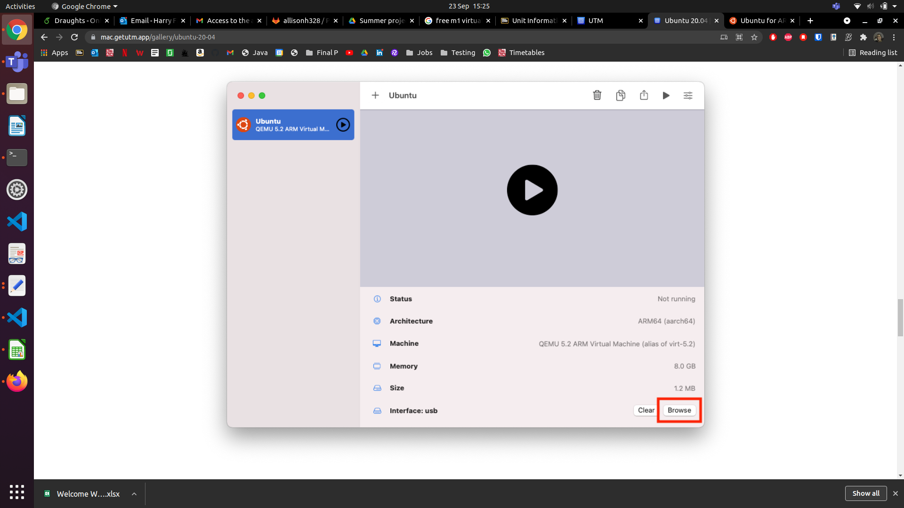
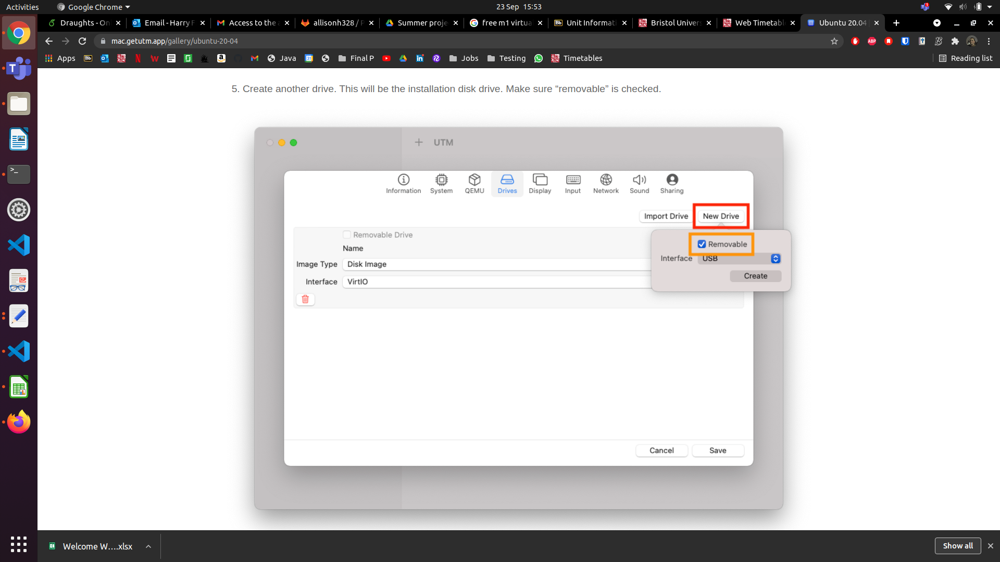

# Ubuntu Virtual Machine for Mac users (and M1 users)
 
UTM will work for M1 macs
https://getutm.app/
 
You will need to install UTM and download the Ubuntu driver. All the instructions you need are here:
https://mac.getutm.app/gallery/ubuntu-20-04
 
After installing UTM and downloading the Ubuntu .iso file you can follow the instructions from the link above. The pictures will get you as far as installing the Ubuntu machine command line interface, and after this there are a few commands to install the GUI (the stuff that lets you use web browsers etc...)
 
Once you reach the screenshot below, your screen will look slightly different. You will need to access the drop-down menu and browse your computer for the Ubuntu .iso file you downloaded earlier. This is crucial for running the Ubuntu VM. 

 
After you've configured all this, you will be greeted with a command line installation of Ubuntu, you will want to accept the defaults for everyhthing and then reboot. At some point the installation will ask you if you are sure you want to wipe the disk (or something like that), don't worry- this is just wiping the VM, not your actual computer. If the reboot is taking a long time and nothing i shappening on screen, force the VM shut down by clicking the square stop button and restart it with the play button. 
 
Once you have a working command line for ubuntu, you can run the commands at the bottom of the instructions page linked above. Again, you'll command the machine to reboot and it might not reboot properly. If it gets stuck just force it to exit and restart the VM. 

when you get to this point make sure that you have created 2 drivers. One with "removable" unticked, and one with "removable" ticked

