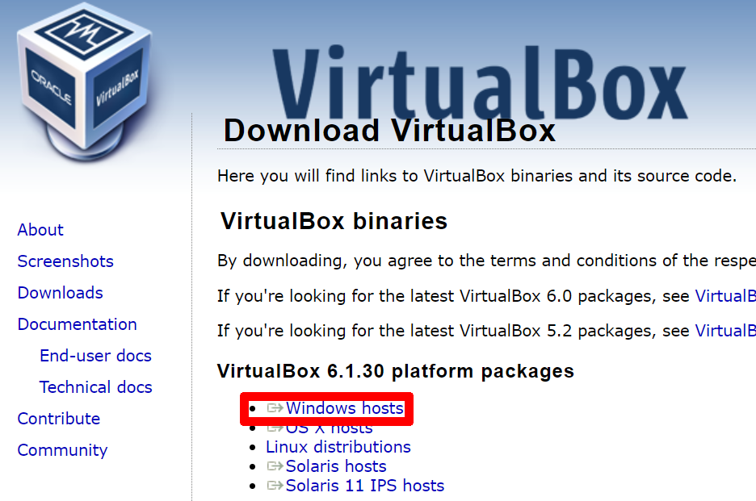
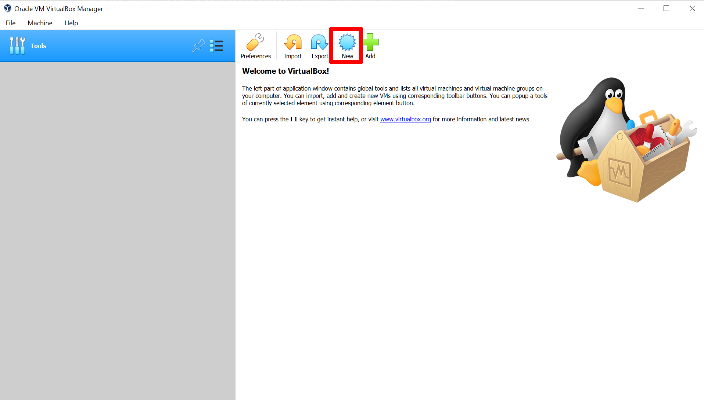
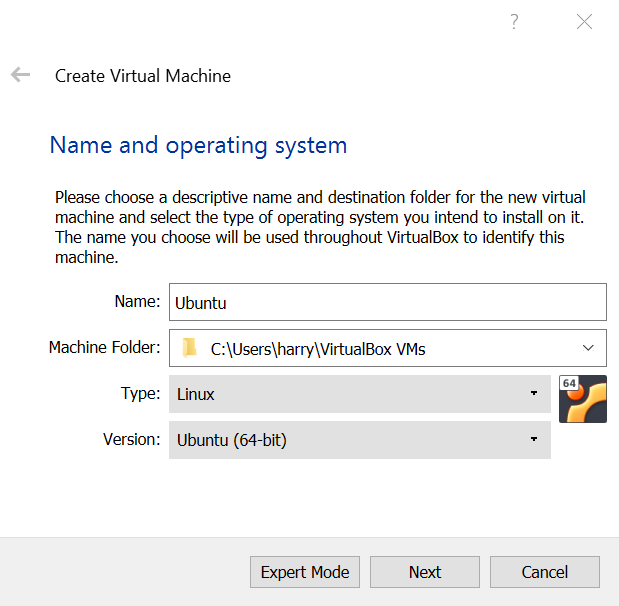
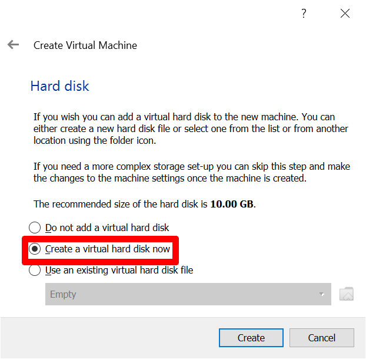
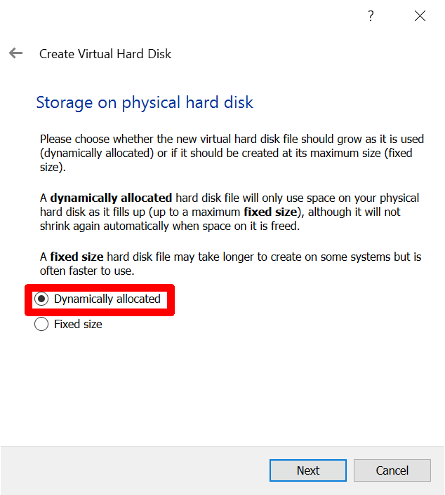
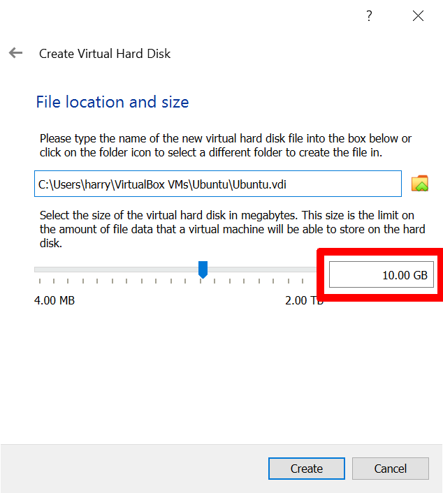
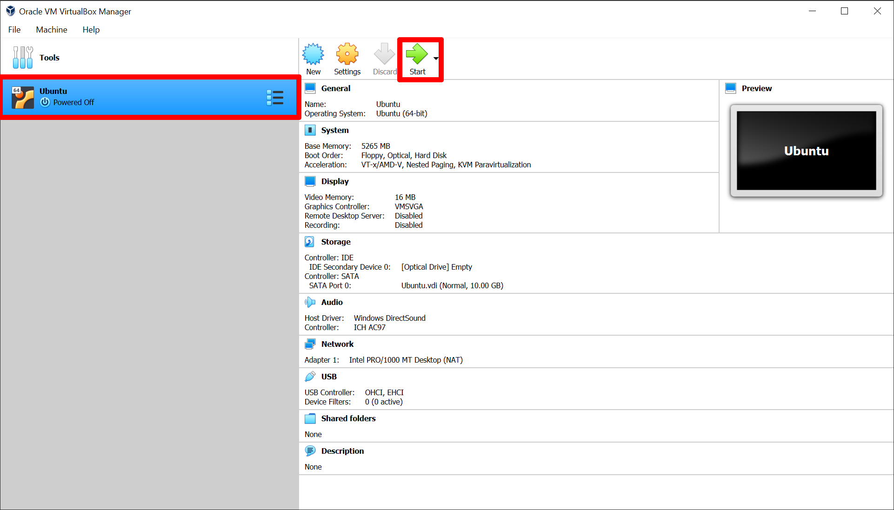
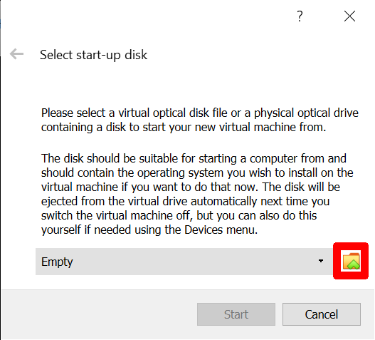
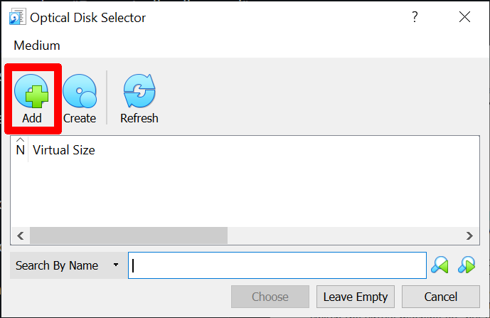
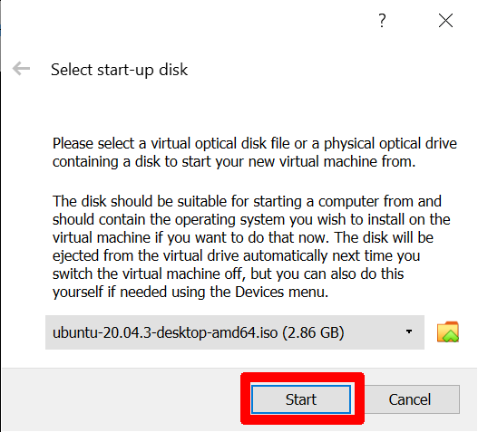

# VirtualBox in Windows

### VirtualBox:

##### 1. Download and install VirtualBox (select "Windows hosts"):
https://www.virtualbox.org/wiki/Downloads

##### 2. Download Ubuntu (we are just downloading it for now):
https://ubuntu.com/download/desktop

##### 3. Open VirtualBox

##### 4. Select the blue circle star for new

##### 5. Fill in the details as:
- Name = Ubuntu
- Type = Linux
- Version = Ubuntu (64-bit)

##### 6. Next page provide as much RAM as you like (The more you give, the faster the VM will be when it's running but the slower your other programs will run outside the VM)

##### 7. Next page select "Create virtual hard disk now"

##### 8. Next page select "VDI"

##### 9. Next page select "Dynamically allocated"

##### 10. Next page; toggle the ammount of space you want to reserve for the virtual machine, this can be whatever you like but MUST be >=10GB otherwise the installation won't work.

##### 11. Start the VM by selecting it in VirtualBox and clicking start

##### 12. You are prompted to select the startup disk, click on the folder icon with a green bit

##### 13. Click "add" to navigate your filesystem for the Ubuntu iso file we downloaded earlier. Select this and click choose.

##### 14. Now click "start" and the VM will start running

##### 15. Once the VM has spun up you will see a screen promt to "Try Ubuntu" or "install Ubuntu" - choose install

##### 16. Choose language

##### 17. Leave installation type as normal and click continue

##### 18. Select "Erase Disk and install Ubuntu" - don't worry - this is only wiping the virtual disk and not your actual computer

##### 19. Click "install now"

##### 20. Click "continue" on the prompt

##### 21. Select time zone

##### 22. Fill in name and password and click continue to begin installation (this will take a while)

##### 23. Installation complete - click "restart now"

##### 24. You will be prompted to remove the installation medium - press enter

##### 25. The VM will restart

##### 26. You now have a VM running (in a tiny window) - we need to change this

##### You're done!

### Extra: Adjusting the screen size

##### 1. At the bottom right of the VM there will be a small bit of text which refers to your host key. You need to remember what that is! Mine says "RIGHT ALT". We need to remember this because we need to be able to toggel full screen.

##### 2. (If you want to change it, go to File -> preferences -> Input and click on the text next to "host key" and press the key you would prefer)

##### 3. press your host key with 'F' to go full screen - notice the vm screen size doesn't change

##### 4. Click on the square grid (bottom left) to see your applciations

##### 5. Type "settings" in the search bar and open settings (in full screen mode)

##### 6. Select "Screen Display"

##### 7. Here, you can change the screen resolution to match your screen (hint: if you can't see the square grid in the bottom left, you've gone too big!)

##### 8. Open a terminal by pressing CTRL+T

##### 9. run "sudo apt update && sudo apt upgrade && sudo apt install gcc"

##### All done! To exit the VM you can shut it down like a regular PC and start it from VirtualBox.

